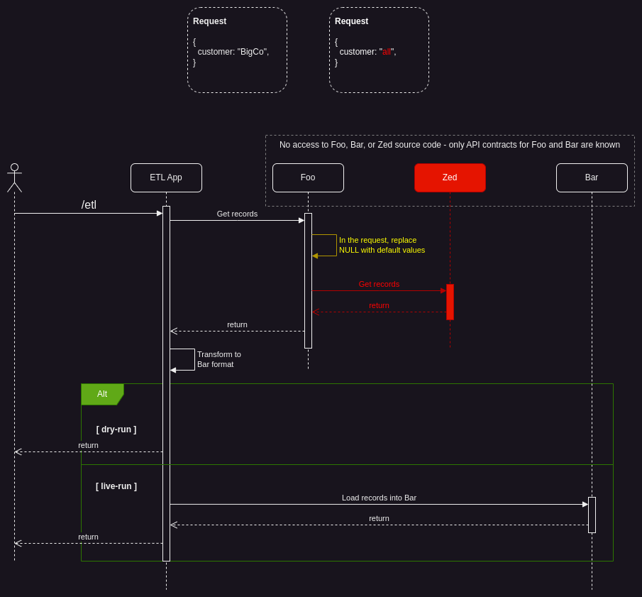

# E2E Demo
This repo contains four applications. These applications can be used to demonstrate aspects of E2E testing and allow engineers to explore and experiment in a safe local environment.

# The Premise
You are an engineer and you (and your team) have been tasked with creating an Extract-Transform-Load application (`ETL`) to extract advertisement data from a deprecated `Foo` application and load it into the new `Bar` application. The data layer is provided by the `Zed` application.

The sequence expressed in the diagram below will serve as the logical premise for the demo and provide a psuedo realistic distributed sytsem for experimentation. If the image is not displayed, you may open `e2e-testing-details.png`.

The yellow and red content represent logic or services that are unknown and unaccessible to the engineering team. These unknowns will be the focus of the demo.



# Setting up the environment

## Build Binaries
Navigate to each application's directory and run make to build the binary
```
cd <repo>/foo && make
cd <repo>/bar && make
cd <repo>/zed && make
cd <repo>/etl && make
```

## Option 1) Docker
### Build Docker Images
```
# note: Mac M1 users may wish to use the <repo>/arm64 directory

cd <repo>/amd64
docker compose build
```

### Start the application
```
docker compose up
```
Example output:
```
$ docker compose up
[+] Building 0.0s (0/0)                                                                                                                                                                      
[+] Running 5/0
 ✔ Network amd64_default  Created                                                                                                                                                       0.1s 
 ✔ Container bar          Created                                                                                                                                                       0.0s 
 ✔ Container zed          Created                                                                                                                                                       0.0s 
 ✔ Container foo          Created                                                                                                                                                       0.0s 
 ✔ Container etl          Created                                                                                                                                                       0.0s 
Attaching to bar, etl, foo, zed
etl  | 2023/06/28 06:19:36 bar hostname: bar:8083
etl  | 2023/06/28 06:19:36 foo hostname: foo:8081
etl  | 2023/06/28 06:19:36 starting etl service on port -> 8084
foo  | 2023/06/28 06:19:36 zed hostname: zed:8082
foo  | 2023/06/28 06:19:36 starting foo service on port -> 8081
zed  | 2023/06/28 06:19:36 starting zed service on port -> 8082
bar  | 2023/06/28 06:19:36 starting bar service on port -> 8083
```

## Option 2) Run each binary individually
Navigate to each application's directory in a new terminal and execute the application. 

_Note: Mac M1 users may with to use the `<repo>/<app>/arm64` directories._
```
# Terminal 1
cd <repo>/foo/amd64 && ./main

# Terminal 2
cd <repo>/bar/amd64 && ./main

# Terminal 3
cd <repo>/zed/amd64 && ./main

# Terminal 4
cd <repo>/etl/amd64 && ./main
```

The environment should be successfully setup at this point, hopefully...

# Validate Environment Functionality

## Pre-Requisites
- Install Postman UI and create free account (https://www.postman.com/downloads/)
- Install Node JS (https://nodejs.org/en/download)
- Install Newman CLI runner (https://support.postman.com/hc/en-us/articles/115003703325-How-to-install-Newman)

## Execute Control Collection
Navigate to the `<repo>/e2e-control` directory and run the collection
```
cd <repo>/e2e-control && newman e2e-demo.postman_collection.json
```
Expected Output:
```
$ newman run e2e-demo.postman_collection.json
newman

E2E Demo

❏ ETL
↳ Migrate Records - Dry Run
  POST http://localhost:8084/etl [201 Created, 406B, 24ms]
  ✓  Status code is 201
  ✓  Ads array should not be empty
  ┌
  │ 'checking index: ', 0
  │ 'checking index: ', 1
  │ 'checking index: ', 2
  │ 'checking index: ', 3
  └
  ✓  All fields in all elements of Ads array should be populated
  ✓  Migrated value should be greater than 0

❏ Foo
↳ Get Ads
  POST http://localhost:8081/ads [200 OK, 398B, 3ms]
  ✓  Status code is 200
  ✓  Ads array should not be empty
  ┌
  │ 'checking index: ', 0
  │ 'checking index: ', 1
  │ 'checking index: ', 2
  │ 'checking index: ', 3
  └
  ✓  All fields in all elements of Ads array should be populated
  ✓  Count value should be greater than 0

❏ Bar
↳ Create New Records
  POST http://localhost:8083/ads [201 Created, 80B, 3ms]
  ✓  Status code is 201

❏ Zed
↳ Get All Ads
  POST http://localhost:8082/ads [200 OK, 398B, 2ms]
  ✓  Status code is 200
  ✓  Ads array should not be empty
  ┌
  │ 'checking index: ', 0
  │ 'checking index: ', 1
  │ 'checking index: ', 2
  │ 'checking index: ', 3
  └
  ✓  All fields in all elements of Ads array should be populated
  ✓  Count value should equal Ads array length
  ✓  Count value should be 4

↳ Get AlphaCo Ads
  POST http://localhost:8082/ads [200 OK, 198B, 1ms]
  ✓  Status code is 200
  ✓  Ads array should not be empty
  ┌
  │ 'checking index: ', 0
  └
  ✓  All fields in all elements of Ads array should be populated
  ✓  Count value should equal Ads array length
  ✓  Count value should be 1

┌─────────────────────────┬─────────────────┬─────────────────┐
│                         │        executed │          failed │
├─────────────────────────┼─────────────────┼─────────────────┤
│              iterations │               1 │               0 │
├─────────────────────────┼─────────────────┼─────────────────┤
│                requests │               5 │               0 │
├─────────────────────────┼─────────────────┼─────────────────┤
│            test-scripts │               5 │               0 │
├─────────────────────────┼─────────────────┼─────────────────┤
│      prerequest-scripts │               0 │               0 │
├─────────────────────────┼─────────────────┼─────────────────┤
│              assertions │              19 │               0 │
├─────────────────────────┴─────────────────┴─────────────────┤
│ total run duration: 106ms                                   │
├─────────────────────────────────────────────────────────────┤
│ total data received: 960B (approx)                          │
├─────────────────────────────────────────────────────────────┤
│ average response time: 6ms [min: 1ms, max: 24ms, s.d.: 8ms] │
└─────────────────────────────────────────────────────────────┘
```