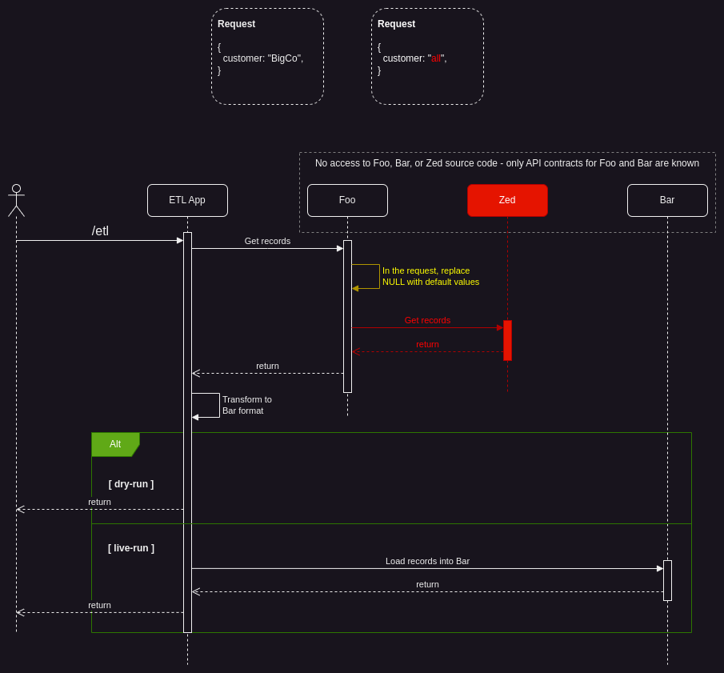

# ETL Application
This application reads records from the `Foo` application and loads those records into the `Bar` application.

# The Premise
You are an engineer and you (and your team) have been tasked with creating an Extract-Transform-Load application (`ETL`) to extract advertisement data from a deprecated `Foo` application and load it into the new `Bar` application. The data layer is provided by the `Zed` application.

The sequence expressed in the diagram below will serve as the logical premise for the demo and provide a psuedo realistic distributed sytsem for experimentation. If the image is not displayed, you may open `e2e-testing-details.png`.

The yellow and red content represent logic or services that are unknown and unaccessible to the engineering team. These unknowns will be the focus of the demo.



# E2E Test Case Study
Navigate to the e2e directory and run the collection
```
cd <repo>/etl/e2e && newman run e2e-etl.postman_collection.json
```
Expected Output:
```
$ newman run e2e-etl.postman_collection.json -e etl-local.postman_environment.json 
newman

E2E ETL Tests

❏ ETL
↳ Migrate Records - Dry Run
  POST http://localhost:8084/etl [201 Created, 398B, 26ms]
  ✓  Status code is 201
  ✓  Ads array should not be empty
  ┌
  │ 'checking index: ', 0
  │ 'checking index: ', 1
  │ 'checking index: ', 2
  │ 'checking index: ', 3
  └
  ✓  All fields in all elements of Ads array should be populated
  ✓  Migrated value should be greater than 0

┌─────────────────────────┬──────────────────┬──────────────────┐
│                         │         executed │           failed │
├─────────────────────────┼──────────────────┼──────────────────┤
│              iterations │                1 │                0 │
├─────────────────────────┼──────────────────┼──────────────────┤
│                requests │                1 │                0 │
├─────────────────────────┼──────────────────┼──────────────────┤
│            test-scripts │                1 │                0 │
├─────────────────────────┼──────────────────┼──────────────────┤
│      prerequest-scripts │                0 │                0 │
├─────────────────────────┼──────────────────┼──────────────────┤
│              assertions │                4 │                0 │
├─────────────────────────┴──────────────────┴──────────────────┤
│ total run duration: 54ms                                      │
├───────────────────────────────────────────────────────────────┤
│ total data received: 284B (approx)                            │
├───────────────────────────────────────────────────────────────┤
│ average response time: 26ms [min: 26ms, max: 26ms, s.d.: 0µs] │
└───────────────────────────────────────────────────────────────┘
```

## The Problem
While the E2E tests will pass as is, there is a `not-empty` asertion for the `customer` field which is allowing this. The assertion should be asserting on the **value** of the `customer` field instead of whether it is empty or not. See the following code from this application's `e2e/e2e-etl.postman_collection.json`
```
pm.test("All fields in all elements of Ads array should be populated", function () {
    var jsonData = pm.response.json();
    for (i=0; i<jsonData.ads.length; i++) {
        console.log("checking index: ", i);
        pm.expect(jsonData.ads[i].id).greaterThan(0);

        // The customer assertion is where we can catch the 
        // "bad" logic in the Foo application if we use a value 
        // assertion rather than a not empty assertion. The 
        // below not-empty assertion will pass:
        pm.expect(jsonData.ads[i].customer).not.empty;

        // Now replace with the following line and 
        // execute the request again to get the desired failure:
        //
        // pm.expect(jsonData.ads[i].customer).is.eql("BigCo");
        
        pm.expect(jsonData.ads[i].info).not.empty;
    }
});
```

## The Solution
Follow the instructions in the comments and replace the `not-empty` assertion with the `eql`:
```
pm.test("All fields in all elements of Ads array should be populated", function () {
    var jsonData = pm.response.json();
    for (i=0; i<jsonData.ads.length; i++) {
        console.log("checking index: ", i);
        pm.expect(jsonData.ads[i].id).greaterThan(0);

        // The customer assertion is where we can catch the 
        // "bad" logic in the Foo application if we use a value 
        // assertion rather than a not empty assertion. The 
        // below not-empty assertion will pass:
        // pm.expect(jsonData.ads[i].customer).not.empty;

        // Now replace with the following line and 
        // execute the request again to get the desired failure:
        //
        pm.expect(jsonData.ads[i].customer).is.eql("BigCo");
        
        pm.expect(jsonData.ads[i].info).not.empty;
    }
});
```
Now the test will rightly fail indicating that something did not behave as expected during the end-to-end flow
```
$ newman run e2e-etl.postman_collection.json -e etl-local.postman_environment.json 
newman

E2E ETL Tests

❏ ETL
↳ Migrate Records - Dry Run
  POST http://localhost:8084/etl [201 Created, 398B, 29ms]
  ✓  Status code is 201
  ✓  Ads array should not be empty
  ┌
  │ 'checking index: ', 0
  └
  1. All fields in all elements of Ads array should be populated
  ✓  Migrated value should be greater than 0

┌─────────────────────────┬──────────────────┬──────────────────┐
│                         │         executed │           failed │
├─────────────────────────┼──────────────────┼──────────────────┤
│              iterations │                1 │                0 │
├─────────────────────────┼──────────────────┼──────────────────┤
│                requests │                1 │                0 │
├─────────────────────────┼──────────────────┼──────────────────┤
│            test-scripts │                1 │                0 │
├─────────────────────────┼──────────────────┼──────────────────┤
│      prerequest-scripts │                0 │                0 │
├─────────────────────────┼──────────────────┼──────────────────┤
│              assertions │                4 │                1 │
├─────────────────────────┴──────────────────┴──────────────────┤
│ total run duration: 59ms                                      │
├───────────────────────────────────────────────────────────────┤
│ total data received: 284B (approx)                            │
├───────────────────────────────────────────────────────────────┤
│ average response time: 29ms [min: 29ms, max: 29ms, s.d.: 0µs] │
└───────────────────────────────────────────────────────────────┘

  #  failure                          detail                                                                                                                          
                                                                                                                                                                      
 1.  AssertionError                   All fields in all elements of Ads array should be populated                                                                     
                                      expected 'AlphaCo' to deeply equal 'BigCo'                                                                                      
                                      at assertion:2 in test-script                                                                                                   
                                      inside "ETL / Migrate Records - Dry Run"
```
The exact location of the issue is in the Foo service in the method `func (api *HttpView) getAdsByCustomer(w http.ResponseWriter, r *http.Request)`
```
// Note: the following if statement represents some old "bad" logic unknown to the dev
// team and the client. This is what we will be trying to catch with the ETL
// applications E2E tests
customer := r.URL.Query().Get(`valeu`)
if customer == `` {
  api.getAllAds(w, r)
  return
}
// end "bad" logic example
```